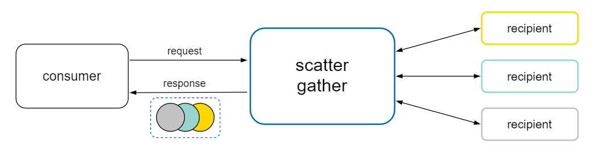

# NScatterGather


<details>
<summary>Table of Contents</summary>

[Intro](#Intro)<br/>
[When to use](#When-to-use)<br/>
[How to use](#How-to-use)<br/>
[Special cases](#Special-cases)<br/>
[Samples](#Samples)<br/>
</details>

# Intro

The Scatter-Gather pattern: send a request message to multiple recipients, and then aggregate the results into a single response.



It limits the coupling between the consumer and the recipients in integration scenarios, and provides standard error-handling and timeout capabilities.

# When to use

The pattern best fits the following scenarios: *competing tasks* and *task parallelization*.

### Competing Tasks

The recipients compete in order to provide the best, or the fastest, response to the request:

** TODO: img **

The consumer will then pick the best value from the aggregated response.

### Task parallelization

The tasks compute  operations concurrently:

** TODO: img **

The aggregated response will then contain diverse result types, possibly meant to be used together

# How to use

The recipients for a request, and optionally a response type, are identifyed using reflection: *no binding contracts* are used (e.g. `IRecipient`).<br/>
This allows for less friction in both the implementation and the maintenance of the integrations, and, furthermore, to identify the target methods by conventions (i.e. sync/async).

#### `RecipientsCollection`:
identifies the registry of recipients that are eligible to be invoked
```csharp
var collection = new RecipientsCollection();
collection.Add<Foo>();
collection.Add(new Bar());
```

#### `Aggregator`:
responsible for sending the requests to all the available recipients that can support the desired request/response types, and aggregating the results
```csharp
var aggregator = new Aggregator(collection);

// Send a request to all the recipients
// capable of accepting and int value.
// The results are then combined in the response:
AggregatedResponse<object> objects = await aggregator.Send(42);

// The following overload can be used when
// the return type is either known or binding:
AggregatedResponse<string> strings = await aggregator.Send<int, string>(42);

// In the second case, only the recipients that accept
// an int value and return a string value will be invoked.
```

#### `AggregatedResponse`:
contains the results of the scatter-gather operation, differentiating between the completed results, the faulted and the incomplete recipients:
```csharp
var completed = response.Completed[0];
// (Type recipientType, string result) = completed;

var faulted = response.Faulted[0];
// (Type recipientType, Exception ex) = faulted;

var incomplete = response.Incomplete[0];
// Type recipientType = incomplete;
```

# Special cases

## Handling async methods

The `Aggregator` exposes async-only methods for sending requests.

By convention, even if the consumer requested only results of type `TResponse`, a recipient that returns `Task<TResponse>` (or `ValueTask<TResponse>`) will still be invoked and its result awaited:

```csharp
class Foo { public int Echo(int n) => n; }
class Bar { public Task<int> EchoAsync(int n) => Task.FromResult(n); }

 // Nothing changes!
var response = await aggregator.Send(42);
// [ 42, 42 ]
```

## Handling conflicts

Sometimes, a recipient can have two or more methods conflicting, given a request type:
```csharp
class Foo
{
    public int Double(int n) => n * 2;
    public long Triple(int n) => n * 3L;
}
```

In this case, the aggregator will be able to invoke the recipient only if the return type of the conflicting methods is different, and it's explicitely defined by the consumer:
```csharp
// The recipient won't be used.
_ = await aggregator.Send(42);

// Method "Triple" will be invoked.
var response = await aggregator.Send<int, long>(42);
```

# Samples

### Hello world
```csharp
class Foo { public int Double(int n) => n * 2; }
class Bar { public long Square(int n) => n * 1L * n; }

var response = await aggregator.Send(42);
// [ 84, 1764L ]
```

### Specify the response type
```csharp
class Foo { public string Stringify(int n) => n.ToString(); }
class Bar { public long Longify(int n) => n * 1L; }

var onlyStrings = await aggregator.Send<int, string>(42);
// [ "42" ]
```

### Invoke async methods
```csharp
class Foo { public string Stringify(int n) => n.ToString(); }

class Bar
{
    public Task<long> Longify(int n)
    {
        await Task.Yield();
        return n * 1L;
    }
}

var response = await aggregator.Send(42);
// [ "42", 42L ]
```

### Error handling
```csharp
class Foo
{
    public string Todo(string s) =>
        throw new NotImplementedException("TODO");
}

var response = await aggregator.Send("Don't Panic");
var (recipientType, exception) = response.Faulted[0];
// ( typeof(Foo), NotImplementedException("TODO") )
```

### Timeout
```csharp
class Foo
{
    public Task<int> Block(int n)
    {
        var tcs = new TaskCompletionSource<int>();
        return tcs.Task; // It will never complete.
    }
}

var timeout = TimeSpan.FromSeconds(5);
using var cts = new CancellationTokenSource(timeout);
var response = await aggregator.Send(42, cts.Token);
Type recipientType = response.Incomplete[0];
// typeof(Foo)
```

For more, take a look at the [samples project in solution](samples/NScatterGather.Samples).
