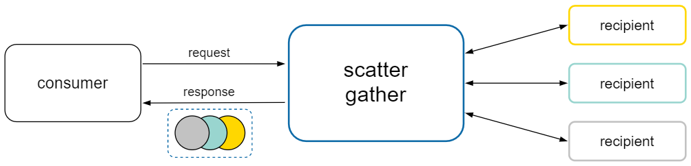
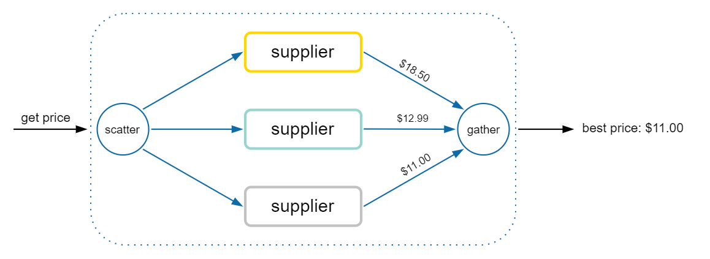
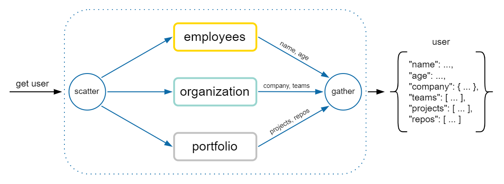

<p align="center">
  <image src="assets/logo/nscattergather-logo-128.png" alt="NScatterGather logo" />
</p>

<h1 align="center">
  NScatterGather
</h1>

<p align="center">
  <a href="https://www.nuget.org/packages/NScatterGather" alt="nuget">
    </a>
  <a href="https://docs.microsoft.com/en-us/dotnet/standard/net-standard#net-implementation-support" alt="netstandard">
    </a>
  <a href="https://github.com/tommasobertoni/NScatterGather/actions?query=workflow%3ACI+branch%3Amain" alt="ci">
    </a>
  <a href="https://coveralls.io/github/tommasobertoni/NScatterGather?branch=main" alt="coverage">
    </a>
  <a href="LICENSE" alt="license">
    </a>
</p>

<details align="center">
  <summary>Table of Contents</summary>

  [Intro](#Intro)<br/>
  [When to use](#When-to-use)<br/>
  [How to use](#How-to-use)<br/>
  [Special cases](#Special-cases)<br/>
  [Samples](#Samples)<br/>
</details>

# Intro

The Scatter-Gather pattern: send a request to multiple recipients, and aggregate the results into a single response.



This pattern helps to limit the coupling between the consumer and the recipients in integration scenarios, and provides standard error-handling and timeout capabilities.

# When to use

## Competing Tasks

The recipients compete in order to provide the best, or the fastest, response to the request. The consumer will then pick the best value from the aggregated response.

[sample:](samples/NScatterGather.Samples.CompetingTasks/) get an item's best price from a collection of suppliers:



## Task parallelization

Different operations are computed concurrently, and their results combined or used together. The result types could be different.

[sample:](samples/NScatterGather.Samples.TaskParallelization/) get a user's data from different services, and then compose into a model:



# How to use
Use a `RecipientsCollection` to register the eligible recipients:
```csharp
var collection = new RecipientsCollection();
collection.Add<Foo>();
collection.Add(new Bar());
```

Use an `Aggregator` for sending the requests to all the available recipients that can support the desired request/response types, and for aggregating the results:
```csharp
var aggregator = new Aggregator(collection);

// Send a request to all the recipients
// capable of accepting and int.
// The results are then combined in the response:
AggregatedResponse<object> objects = await aggregator.Send(42);

// The following overload can be used when
// the return type is either known or binding.
// Only the recipients that accept an int and
// return a string will be invoked:
AggregatedResponse<string> strings = await aggregator.Send<int, string>(42);
```

Inspect the `AggregatedResponse` containing the results of the scatter-gather operation, grouped by _completed_, _faulted_ and _incomplete_:
```csharp
var response = await aggregator.Send<int, string>(42, cancellationToken);

var completed = response.Completed[0];
// (Type recipientType, string result) = completed;

var faulted = response.Faulted[0];
// (Type recipientType, Exception ex) = faulted;

var incomplete = response.Incomplete[0];
// Type recipientType = incomplete;
```

## Embrace [duck typing](https://stackoverflow.com/a/4205163/3743963)

**No binding contracts** are used _(e.g. `IRecipient`)_.<br/>
A recipient is invoked if it defines a method matching the request:
```csharp
class Foo
{
    public string ThisIsInvoked(int n) => n.ToString();
}

class Bar
{
    public int ThisIsInvokedToo(int n) => n * 2;
}

// Invoke every recipient that accepts an int.
_ = await aggregator.Send(42);
```

# Special cases

## Handling async methods

The `Aggregator` exposes async-only methods for sending requests.

Even if the consumer requested only results of type `TResponse`, a recipient that returns `Task<TResponse>`, or `ValueTask<TResponse>`, or any task-like type, will still be invoked and its result awaited:

```csharp
class Foo { public int Echo(int n) => n; }
class Bar { public Task<int> EchoAsync(int n) => Task.FromResult(n); }

// Nothing changes!
var response = await aggregator.Send(42);
// [ 42, 42 ]
```

## Handling conflicts

Sometimes, a recipient can have two or more methods conflicting, given a request type:
```csharp
class Foo
{
    public int Double(int n) => n * 2;
    public long Triple(int n) => n * 3L;
}
```

In this case, the aggregator will be able to invoke the recipient only if the return type of the conflicting methods is different, and it's explicitely defined by the consumer:
```csharp
// The recipient won't be used.
_ = await aggregator.Send(42);

// Method "Triple" will be invoked.
var response = await aggregator.Send<int, long>(42);
```

# Samples

### Hello world
```csharp
class Foo { public int Double(int n) => n * 2; }
class Bar { public long Square(int n) => n * 1L * n; }

var response = await aggregator.Send(42);
// [ 84, 1764L ]
```

### Specify the response type
```csharp
class Foo { public string Stringify(int n) => n.ToString(); }
class Bar { public long Longify(int n) => n * 1L; }

var onlyStrings = await aggregator.Send<int, string>(42);
// [ "42" ]
```

### Invoke async methods
```csharp
class Foo { public string Stringify(int n) => n.ToString(); }

class Bar
{
    public async Task<long> Longify(int n)
    {
        await Task.Yield();
        return n * 1L;
    }
}

var response = await aggregator.Send(42);
// [ "42", 42L ]
```

### Error handling
```csharp
class Foo
{
    public string Todo(string s) =>
        throw new NotImplementedException("TODO");
}

var response = await aggregator.Send("Don't Panic");
var (recipientType, exception) = response.Faulted[0];
// ( typeof(Foo), NotImplementedException("TODO") )
```

### Timeout
```csharp
class Foo
{
    public Task<int> Block(int n)
    {
        var tcs = new TaskCompletionSource<int>();
        return tcs.Task; // It will never complete.
    }
}

var timeout = TimeSpan.FromSeconds(5);
using var cts = new CancellationTokenSource(timeout);

var response = await aggregator.Send(42, cts.Token);
Type recipientType = response.Incomplete[0];
// typeof(Foo)
```

For more, take a look at the [samples project in solution](samples/NScatterGather.Samples).

## Continuous Integration

[](https://github.com/features/actions)
[](https://xunit.net/)
[](https://github.com/coverlet-coverage/coverlet)
[](https://coveralls.io/)
