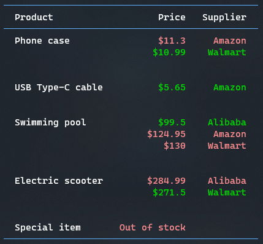

# Competing Tasks


This sample shows a competing tasks scenarion, in which different `Supplier`s try to provide a price for a given `Product` and then the cheapest value is selected.

```csharp
class AmazonSupplier
{
    public async Task<decimal?> PriceProduct(string productId)
    {
        await Task.Delay(200);
        return productId switch
        {
            "001" => 11.3m,
            "002" => 5.65m,
            "003" => 124.95m,
            _ => default(decimal?)
        };
    }
}
```

Note: not all providers have all the products, so a `null` response is interpreted as "not available, here".

The result shows which suppliers provided a price for each product, and the best one is highlighted:


